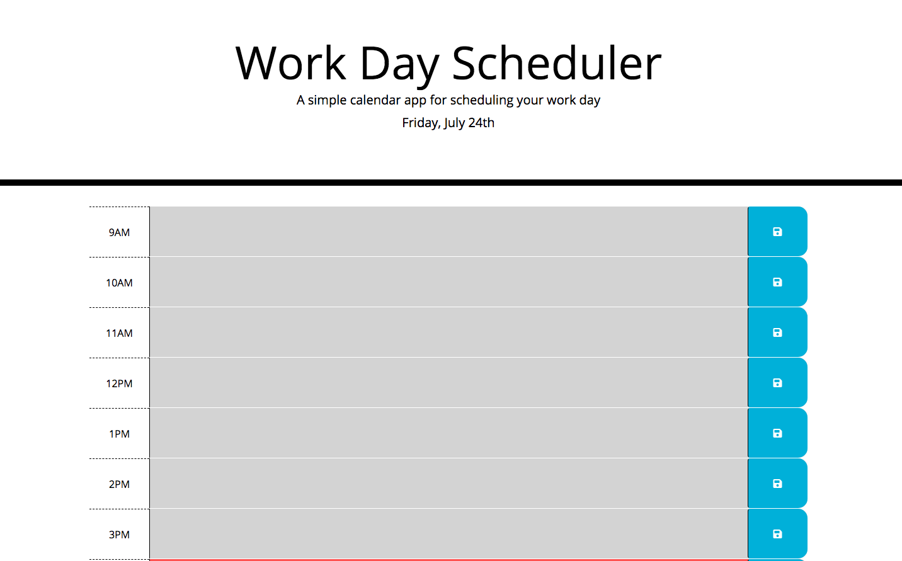
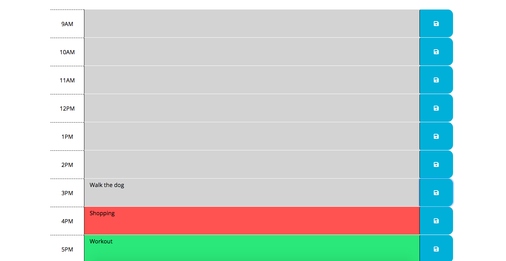

# Work Day Scheduler

## Application  objectives:

The purpose of this application allows the  user to create  a scheduler  to input events for that time. The scheduler is suppose to display a color for each time block within the scheduler which represent's the   past hour, current hour, and future hour in real time. The user's event is then stored onto the display screen of the calendar once the user hits the save button.

 ## Click [here](https://brianlevin.github.io/Work-Day-Scheduler/) for the live app. 
 
 This is the home screen:
 
 
  
  
 The user can then put in events that they need to complete during that time:
  
  
  
  The events will then be saved if the user refreshes the page:
    
   
## Libraries and Frameworks:

- HTML
- CSS
- Javascript
- Jquery
- Moment.js

## Email:

bml201095@gmail.com

